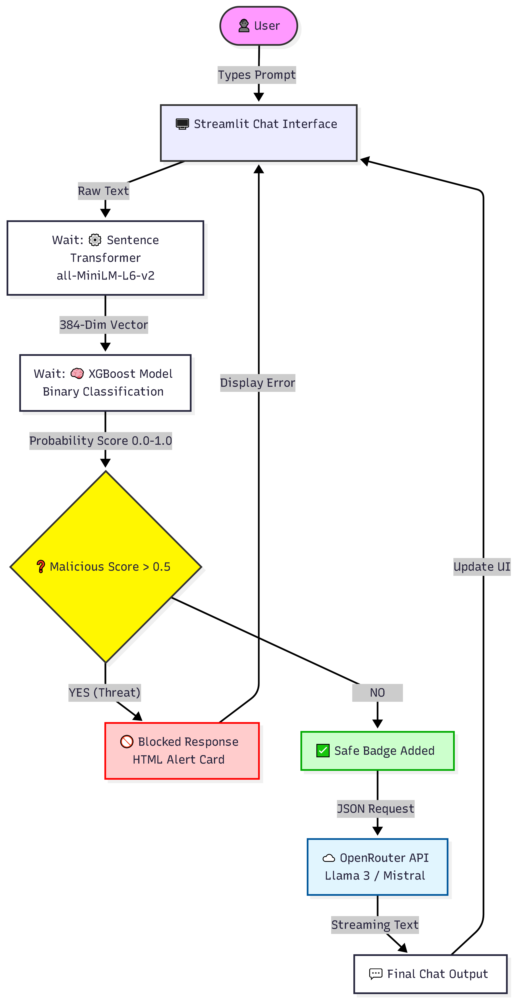
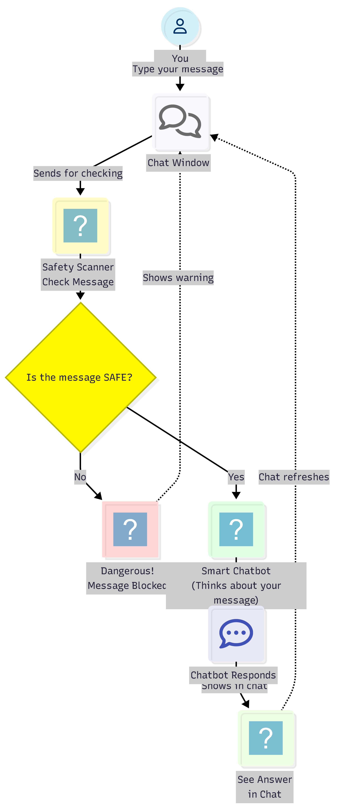

# 🛡️ LLM-Security-Firewall

<div align="center">


### 🚨 Semantic Prompt Injection Firewall for Large Language Models


</div>

---

# 📌 Overview

**LLM-Security-Firewall** is a lightweight semantic firewall designed to protect Large Language Models (LLMs) against:

* 🚫 Prompt Injection Attacks
* 🔓 Jailbreak Attempts
* 🧠 Role-play Exploits
* ⚠️ Instruction Override Attacks
* 🔐 System Prompt Leakage

The system introduces a **Decoupled Security Architecture** that intercepts and analyzes prompts before they ever reach the LLM.

Unlike traditional keyword filtering systems, this project uses:

* 🧠 Semantic Vector Embeddings
* ⚡ XGBoost Threat Classification
* 📊 Real-time Probability Analysis
* 🛡️ Local Security Inference

This allows the firewall to detect malicious intent even when attacks are obfuscated or rephrased.

---

# 🏗️ System Architecture

<div align="center">


</div>

The firewall operates using a **4-Phase Security Pipeline**:

| Phase                | Description                              |
| -------------------- | ---------------------------------------- |
| 📥 Input & Ingestion | User submits prompt through Streamlit UI |
| 🧠 Semantic Analysis | MiniLM converts prompt into embeddings   |
| 🚦 Logic Gate        | XGBoost classifies malicious probability |
| ☁️ Secure Resolution | Only verified prompts reach the LLM      |

---

# 🔐 Threat Detection Logic

<div align="center">



</div>

The security core performs:

```python
Prompt → Embedding → XGBoost → Threat Score → Decision
```

## ⚙️ Detection Pipeline

### Step 1 — Semantic Vectorization

The prompt is transformed into a **384-dimensional semantic vector** using:

```python
all-MiniLM-L6-v2
```

### Step 2 — Classification

The embedding is analyzed using an **XGBoost classifier**.

### Step 3 — Security Decision

| Threat Score | Action           |
| ------------ | ---------------- |
| > 0.5        | 🚫 BLOCK Prompt  |
| ≤ 0.5        | ✅ Forward to LLM |

---

# 💬 User Interaction Flow

<div align="center">



</div>

The user experience is designed for:

* ⚡ Real-time detection
* 📊 Instant feedback
* 🛡️ Transparent security status
* ☁️ Secure API routing

Malicious prompts are intercepted locally before any external transmission occurs.

---

# ✨ Features

## 🛡️ Security

* Prompt Injection Detection
* Jailbreak Prevention
* Semantic Threat Analysis
* Probability-based Threat Scoring
* Decoupled LLM Firewall

## ⚡ Performance

* Lightweight ML inference
* Low latency (<50ms)
* CPU-friendly deployment
* Real-time classification

## 📊 Interface

* Interactive Streamlit Dashboard
* Plotly Threat Meter
* Session Threat Logs
* Safe/Blocked Visual Alerts

## ☁️ API Integration

* OpenRouter Integration
* Secure Request Routing
* Conditional API Access
* External LLM Protection Layer

---

# 🧠 Machine Learning Pipeline

| Component            | Technology            |
| -------------------- | --------------------- |
| Embedding Model      | Sentence Transformers |
| Semantic Encoder     | all-MiniLM-L6-v2      |
| Classifier           | XGBoost               |
| Frontend             | Streamlit             |
| Backend              | FastAPI               |
| Visualization        | Plotly                |
| API Integration      | OpenRouter            |
| Programming Language | Python                |

---

# 📈 Model Performance

<div align="center">

| Metric                    | Score  |
| ------------------------- | ------ |
| 🎯 Accuracy               | 85.15% |
| 📈 ROC-AUC                | 0.8989 |
| ⚖️ Weighted F1-Score      | 83.85% |
| 🛡️ Precision (Malicious) | 86.20% |
| 🚨 Recall (Malicious)     | 81.50% |

</div>

---

# 📂 Project Structure

```bash
LLM-Security-Firewall/
│
├── streamlit_app.py
├── api_server.py
├── config.py
├── requirements.txt
├── README.md
├── .gitignore
├── .env.example
├── LICENSE
│
├── models/
│   └── xgb_embed_model.json
│
├── notebook/
│   └── PromptInjectionSecurityFilter.ipynb
│
├── assets/
│   ├── architecture-overview.png
│   ├── technical-workflow.png
│   ├── security-decision-flow.png
│   └── chat-flow-diagram.png
│
└── docs/
    ├── Project_Report.pdf
    └── PSF_Presentation.pptx
```

---

# 🚀 Installation

## 1️⃣ Clone Repository

```bash
git clone https://github.com/YOUR_USERNAME/LLM-Security-Firewall.git

cd LLM-Security-Firewall
```

---

## 2️⃣ Install Dependencies

```bash
pip install -r requirements.txt
```

---

## 3️⃣ Configure Environment Variables

Create a `.env` file:

```env
OPENROUTER_API_KEY=your_api_key_here
```

---

# ▶️ Running the Application

## 🔥 Launch Streamlit Frontend

```bash
streamlit run streamlit_app.py
```

---

## ⚡ Launch FastAPI Backend

```bash
uvicorn api_server:app --reload
```

---

# 🔄 Security Workflow

```text
User Prompt
     ↓
Semantic Vectorization
     ↓
XGBoost Threat Classification
     ↓
Threat Score Evaluation
     ↓
┌───────────────┬────────────────┐
│ Malicious     │ Safe           │
│ Prompt        │ Prompt         │
├───────────────┼────────────────┤
│ BLOCK         │ Forward to LLM │
└───────────────┴────────────────┘
```

---

# 📚 Research Contributions

This project demonstrates that:

* Lightweight machine learning models can effectively secure LLMs
* Semantic embeddings outperform traditional keyword filters
* Decoupled architectures reduce inference costs
* Real-time LLM firewalls can operate on standard consumer hardware

---

# 🔮 Future Improvements

* 🧠 FAISS vector database integration
* 🌍 Multilingual attack detection
* 🖼️ Multimodal prompt injection defense
* 💬 Multi-turn conversational memory analysis
* ⚡ Adaptive threshold optimization
* ☁️ Cloud-native deployment support

---

# 📄 Documentation

Detailed research and implementation documents are available inside:

```bash
docs/
```

Including:

* 📘 Research Report
* 📊 Project Presentation
* 🧪 Experimental Results
* 🧠 ML Workflow Analysis

---


# ⭐ Support

If you found this project useful:

* ⭐ Star the repository
* 🍴 Fork the project
* 🛡️ Contribute to LLM security research

---

# 📜 License

This project is licensed under the **MIT License**.

---

<div align="center">

## 🛡️ Secure the Future of AI

### Building Defensive Intelligence for Large Language Models

</div>
